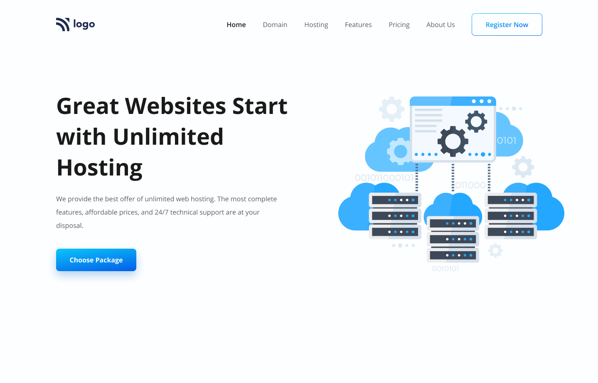

# My Websites Collection

Welcome to my collection of website's Homepage that I have created using pure HTML and CSS. Each website represents a unique project and showcases my skills and creativity.
These are only the Homepages that I have created for Educational Purpose.(1-7 are not responsive, 7-15 are responsive)

## Websites

### 1. What's New Trend

- Technologies: HTML, CSS
- [Repo link](https://github.com/deep-da/Html-Css-Web-Pages/tree/main/live-class-project-01)
- Live Demo: [What's New Trend](https://whats-the-trend-in-2025.netlify.app/)


### 2. Restaurant with Best Food

- Technologies: HTML, CSS
- [Repo link](https://github.com/deep-da/Html-Css-Web-Pages/tree/main/live-class-project-2)
- Live Demo: [Restaurant with Best Food](https://restaurant-with-the-best-food.netlify.app/)


### 3. Online Learing Platform

- Technologies: HTML, CSS
- [Repo link](https://github.com/deep-da/Html-Css-Web-Pages/tree/main/live-class-project-3)
- Live Demo: [Online Learing Platform](https://the-online-learning-platform.netlify.app/)


### 4. Online Code Buliding Platform for coders

- Technologies: HTML, CSS
- [Repo link](https://github.com/deep-da/Html-Css-Web-Pages/tree/main/live-class-project-4)
- Live Demo: [Online Code Buliding Platform for coders](https://online-building-platform-for-coders.netlify.app/)


### 5. Nature is Beautiful 

- Technologies: HTML, CSS
- [Repo link](https://github.com/deep-da/Html-Css-Web-Pages/tree/main/live-class-project-5)
- Live Demo: [Nature is Beautiful](https://nature-is-beautiful.netlify.app/)


### 6. Court-Justice WebApp 

- Technologies: HTML, CSS
- [Repo link](https://github.com/deep-da/Html-Css-Web-Pages/tree/main/live-class-project-6)
- Live Demo: [Court-Justice WebApp](https://court-justice-webapp.netlify.app/)


### 7. Online Shopping

- Technologies: HTML, CSS
- [Repo link](https://github.com/deep-da/Html-Css-Web-Pages/tree/main/live-class-project-7)
- Live Demo: [Online Shopping](https://online-shopping-webapp.netlify.app/)


### 8. WebDesigning App 

- Technologies: HTML, CSS
- [Repo link](https://github.com/deep-ansingkar/Html-Css-Web-Pages/tree/main/live-class-project-8)
- Live Demo: [WebDesigning App](https://web-designing-app.netlify.app/)


### 9 Worldclass Production

- Technologies: HTML, CSS
- [Repo link](https://github.com/deep-ansingkar/Html-Css-Web-Pages/tree/main/live-class-project-9)
- Live Demo: [Worldclass Production](https://worldclass-production.netlify.app/)


### 10. Interier Design Web App

- Technologies: HTML, CSS
- [Repo link](https://github.com/deep-ansingkar/Html-Css-Web-Pages/tree/main/live-class-project-10)
- Live Demo: [Interier Design](https://interier-design-application.netlify.app/)


### 11. Web Hosting App

- Technologies: HTML, CSS
- [Repo link](https://github.com/deep-ansingkar/Html-Css-Web-Pages/tree/main/live-class-project-11)
- Live Demo: [Web Hosting App](https://web-hosting-application.netlify.app/)


### 12. Bussiness Solutions 

- Technologies: HTML, CSS
- [Repo link](https://github.com/deep-ansingkar/Html-Css-Web-Pages/tree/main/live-class-project-12)
- Live Demo: [Bussiness Solutions](https://bussiness-solutions.netlify.app/)


### 13. Website Name 

- Technologies: HTML, CSS
- [Repo link]()
- Live Demo: [Website Name 15](https://www.example15.com)

### 14. Website Name 

- Technologies: HTML, CSS
- [Repo link]()
- Live Demo: [Website Name 15](https://www.example15.com)

### 15. Website Name 

- Technologies: HTML, CSS
- [Repo link]()
- Live Demo: [Website Name 15](https://www.example15.com)

## Contact Me

If you have any questions or would like to know more about any of these websites, please feel free to contact me.

- Email: example@example.com
- LinkedIn: [My LinkedIn Profile](https://www.linkedin.com/in/example)

---

*Thank you for visiting my collection of websites! I hope you enjoy exploring them.*
```

In this Markdown code, you can list each of your 15 websites, providing a brief description, the technologies used, and a live demo link for each. Additionally, you can include your contact information for further inquiries. Don't forget to replace the example links and email address with your actual content.
